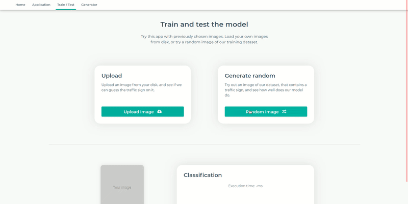

# Traffic signs model
A component of a traffic sign recognition application, that publishes the recognizer model.
## Architecture
### Client
The traffic sign recognizer comes with a SPA client application, that was developed on an Angular 8 platform. The client
supports real time recognition by using the device's camera.
#### Availability
- [Github URL](https://github.com/bizmut32/traffic-signs-client)
- [Published client application](https://trafficsigns.netlify.app/)
#### Demo

---
### Server
The application comes with a deployed Spring Boot server application. The server mediates the communication between the
client and the traffic sign detector.
#### Availability
- [Github URL](https://github.com/bizmut32/traffic-sign-server)
---
### Traffic sign detector
The traffic sign detector is published in this repository. It contains a localizer and a classifier, both 
implemented with the Keras API. The detector is not deployed, due to lack of resources.
## Installation
In order to get the TSR application properly working on your PC follow the following steps.
- Clone the 3 repositories
- Run the following commands in the client repository
```shell script
npm install
npm run start
```
- Run the following commands in the detector repository
```shell script
pipenv install
python runserver 8081
```
- Run the following commands in the server repository
```shell script
mvn clean install
mvn spring-boot:run
```
It is also possible to start each server on a different port. By default the client server runs on 4200, the spring 
server runs on 8080, and the detector runs on 8081.
If you want the detector to run on a different port, start it with
```shell script
python runserver <port number>
```
and start the spring server with
```shell script
mvn spring-boot:run DETECTOR_HOST=http://localhost:<port number>
```